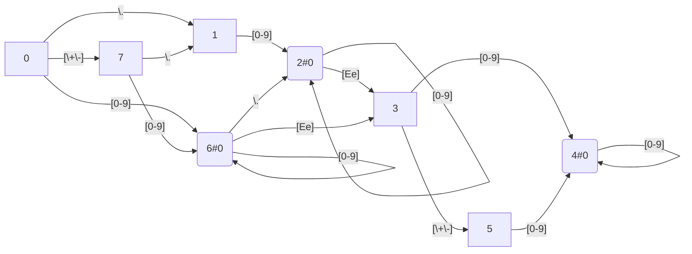

# regex

This little project implements the minimized DFA based lexical analyzer generator described in *Compilers: Principles, Techniques, and Tools (2nd Edition) - Chap. 3*.

Main procedures:

* Parse the given regular expression
* Compute `nullable`, `firstpos`, `lastpos`, `followpos`
* Merge non-distinguishable character groups into classes
* Make DFA states
* Minimize DFA states

Highlights:

* Outputs state transition tables into mermaid graphs
* Tested on simplified C lexical rules

