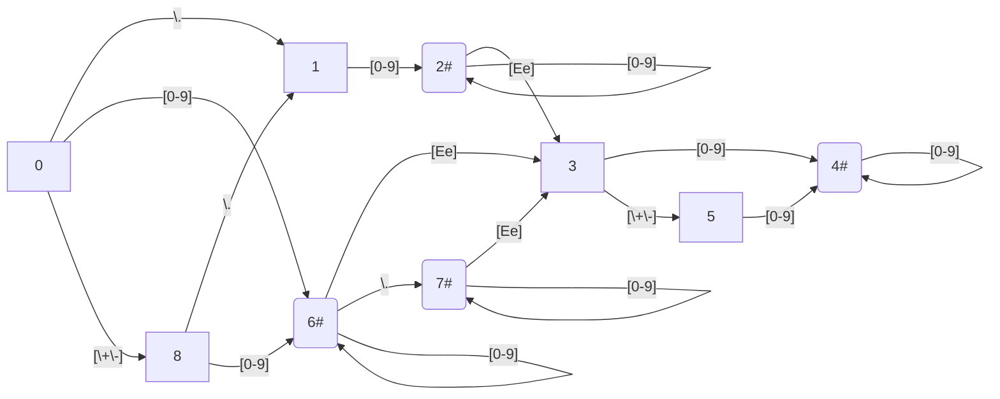

```mermaid
graph LR
0 -- "\." --> 1
0 -- "[0-9]" --> 6
0 -- "[\+\-]" --> 8
1 -- "[0-9]" --> 2
2 -- "[Ee]" --> 3
2 -- "[0-9]" --> 2
2("2#")
3 -- "[0-9]" --> 4
3 -- "[\+\-]" --> 5
4 -- "[0-9]" --> 4
4("4#")
5 -- "[0-9]" --> 4
6 -- "[Ee]" --> 3
6 -- "\." --> 7
6 -- "[0-9]" --> 6
6("6#")
7 -- "[Ee]" --> 3
7 -- "[0-9]" --> 7
7("7#")
8 -- "\." --> 1
8 -- "[0-9]" --> 6
```
